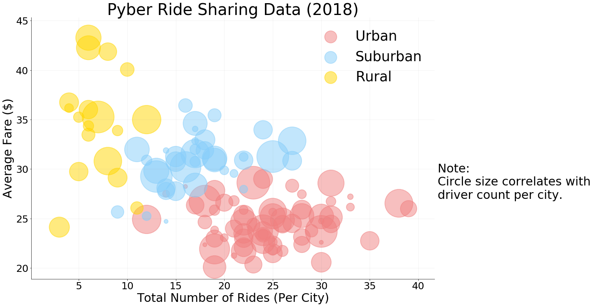

Analysis

    - Average fare per city is highest on rural followed by suburban and urban.
    - Total number of ride per city is highest on urban followed by suburban and rural.
    - Overall, average fare and number of rides have negative correlationship.
    - Total rides are highest on urban areas, lowest on rural areas.
    - Total drivers have much more difference between the city types compared to their total rides, which means there are more 
      drivers per ride in urban areas.

```python
#import libraries
import pandas as pd
import numpy as np
import matplotlib.pyplot as plt
import seaborn as sns

#sns.factorplot
#lmplot, pointplot
```


```python
data_city = pd.read_csv("raw_data/city_data.csv")
data_ride = pd.read_csv("raw_data/ride_data.csv")
data = data_ride.merge(data_city, on="city",how="left")
data.head(5)
```


<div>
<style scoped>
    .dataframe tbody tr th:only-of-type {
        vertical-align: middle;
    }

    .dataframe tbody tr th {
        vertical-align: top;
    }

    .dataframe thead th {
        text-align: right;
    }
</style>
<table border="1" class="dataframe">
  <thead>
    <tr style="text-align: right;">
      <th></th>
      <th>city</th>
      <th>date</th>
      <th>fare</th>
      <th>ride_id</th>
      <th>driver_count</th>
      <th>type</th>
    </tr>
  </thead>
  <tbody>
    <tr>
      <th>0</th>
      <td>Lake Jonathanshire</td>
      <td>2018-01-14 10:14:22</td>
      <td>13.83</td>
      <td>5739410935873</td>
      <td>5</td>
      <td>Urban</td>
    </tr>
    <tr>
      <th>1</th>
      <td>South Michelleport</td>
      <td>2018-03-04 18:24:09</td>
      <td>30.24</td>
      <td>2343912425577</td>
      <td>72</td>
      <td>Urban</td>
    </tr>
    <tr>
      <th>2</th>
      <td>Port Samanthamouth</td>
      <td>2018-02-24 04:29:00</td>
      <td>33.44</td>
      <td>2005065760003</td>
      <td>57</td>
      <td>Urban</td>
    </tr>
    <tr>
      <th>3</th>
      <td>Rodneyfort</td>
      <td>2018-02-10 23:22:03</td>
      <td>23.44</td>
      <td>5149245426178</td>
      <td>34</td>
      <td>Urban</td>
    </tr>
    <tr>
      <th>4</th>
      <td>South Jack</td>
      <td>2018-03-06 04:28:35</td>
      <td>34.58</td>
      <td>3908451377344</td>
      <td>46</td>
      <td>Urban</td>
    </tr>
  </tbody>
</table>
</div>


```python
#pull data from table
groupby_city = data.groupby("city")
average_fare = groupby_city["fare"].mean()
total_rides = groupby_city["ride_id"].count()
driver_count = data_city.set_index("city")["driver_count"]
city_type = data_city.set_index("city")["type"]
summary = pd.DataFrame({"average_fare":average_fare,"total_rides":total_rides,"driver_count":driver_count,"city_type":city_type})
groupby_type = summary.groupby("city_type")
```


```python
#build plot
g = sns.lmplot(x= "total_rides",
               y = "average_fare",
               data=summary,
               palette={'Rural': 'gold', 'Suburban': 'lightskyblue', 'Urban': 'lightcoral'},
               hue="city_type",
               size = 10,
               aspect = 1.5,
               fit_reg=False,
               legend=False,
                   scatter_kws={'s':summary["driver_count"]*100,
                                'alpha':0.5,
                                'linewidth':2}
              )
ax = g.ax
ax.text(42,27,'Note: \nCircle size correlates with \ndriver count per city.').set_fontsize(30)
ax.legend(loc='upper right', fontsize=35, markerscale=.5, frameon=False)
ax.set_title('Pyber Ride Sharing Data (2018)').set_fontsize(40)
ax.set_xlabel('Total Number of Rides (Per City)').set_fontsize(30)
ax.set_ylabel('Average Fare ($)').set_fontsize(30)
ax.tick_params(which='major', labelsize=25)
ax.set_facecolor('white')
ax.grid(color='grey',linestyle='-',linewidth= 1,alpha = 0.1)
g.savefig('bubble.png')
```





```python
data_group = data.groupby(by='type',as_index=True)

type_index = list(type_fare.index)
type_fare = data_group['fare'].sum()
plt.pie(type_fare,explode = (0.1,0,0), labels = type_index, colors = ['gold', 'lightskyblue', 'lightcoral'],autopct="%1.1f%%",
       shadow = True, startangle = 40)
plt.axis('equal')
plt.title('% of Total Fares by City Type')
plt.savefig('fare by city type.png')
```


```python
type_index = list(type_fare.index)
type_ride = data_group.size()
plt.pie(type_ride,explode = (0.1,0,0), labels = type_index, colors = ['gold', 'lightskyblue', 'lightcoral'],autopct="%1.1f%%",
       shadow = True, startangle = 40)
plt.axis('equal')
plt.title('% of Total Rides by City Type')
plt.savefig('ride by city type.png')
```


```python
city_group = data_city.groupby('type')

type_index = list(type_fare.index)
type_drivers = city_group['driver_count'].sum()
plt.pie(type_drivers,explode = (0.1,0,0), labels = type_index, colors = ['gold', 'lightskyblue', 'lightcoral'],autopct="%1.1f%%",
       shadow = True, startangle = 40)
plt.axis('equal')
plt.title('% of Total Drivers by City Type')
plt.savefig('drivers by city type.png')
```


